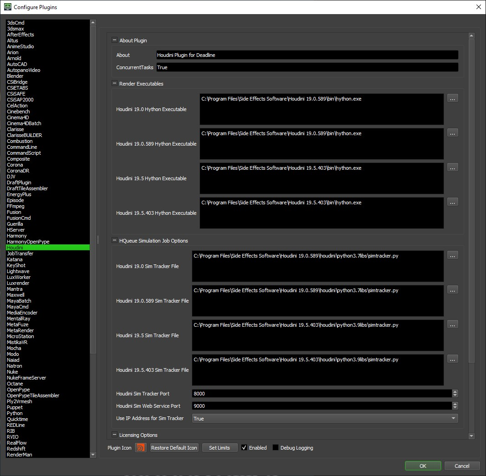

import Tabs from '@theme/Tabs';
import TabItem from '@theme/TabItem';


## Preparation

For [AWS Thinkbox Deadline](https://www.awsthinkbox.com/deadline) support you need to set a few things up in both OpenPype and Deadline itself

1. Deploy OpenPype executable to all nodes of Deadline farm. See [Install & Run](admin_use.md)

2. Enable Deadline Module in the [OpenPype Admin Settings](admin_settings_system.md#deadline).

3. Set up *Deadline Web API service*. For more details on how to do it, see [here](https://docs.thinkboxsoftware.com/products/deadline/10.1/1_User%20Manual/manual/web-service.html).

4. Point OpenPype to your deadline webservice URL in the [OpenPype Admin Settings](admin_settings_system.md#deadline).

5. Install our custom plugin and scripts to your deadline repository. It should be as simple as copying content of `openpype/modules/deadline/repository/custom` to `path/to/your/deadline/repository/custom`.

Multiple different DL webservice could be configured. First set them in point 4., then they could be configured per project in `project_settings/deadline/deadline_servers`.
Only single webservice could be a target of publish though.

### DL Houdini plugin

It's supported to pass houdini patch version to deadline


This requires updating `DeadlineRepo\plugins\Houdini\Houdini.param` with the deisred `Hython_Executable` and `SimTracker` because there's no way to add houdini version from deadline Configure PLugins UI

To achieve that:
1. Copy these blocks to `Houdini.param`
2. Replace `<major>`, `<minor>` and `<patch>` with the desired numbers
3. Update paths from deadline UI

#### Hython Executable block
```
[Houdini<major>_<minor>_<patch>_Hython_Executable]
Label=Houdini <major>.<minor>.<patch> Hython Executable
Category=Render Executables
CategoryOrder=0
Type=multilinemultifilename
Index=14
Default=C:\Program Files\Side Effects Software\Houdini 19.0.000\bin\hython.exe;/Applications/Houdini/Houdini19.0.000/Frameworks/Houdini.framework/Versions/19.0.000/Resources/bin/hython;/opt/hfs19.0/bin/hython
Description=The path to the hython executable. It can be found in the Houdini bin folder.
```

#### Sim Tracker block
```
[Houdini<major>_<minor>_<patch>_SimTracker]
Label=Houdini <major>.<minor>.<patch> Sim Tracker File
Category=HQueue Simulation Job Options
CategoryOrder=1
Type=multilinemultifilename
Index=10
Default=C:\Program Files\Side Effects Software\Houdini 19.0.000\houdini\python3.7libs\simtracker.py;/Applications/Houdini/Houdini19.0.000/Frameworks/Houdini.framework/Versions/19.0.000/Resources/houdini/python3.7libs/simtracker.py;/opt/hfs19.0/houdini/python3.7libs/simtracker.py
Description=The path to the simtracker.py file that is used when distributing HQueue sim jobs. This file can be found in the Houdini install.
```
So, it may look similar to this



## Configuration

OpenPype integration for Deadline consists of two parts:

- The `OpenPype` Deadline Plug-in
- A `GlobalJobPreLoad` Deadline Script (this gets triggered for each deadline job)

The `GlobalJobPreLoad` handles populating render and publish jobs with proper environment variables using settings from the `OpenPype` Deadline Plug-in.

The `OpenPype` Deadline Plug-in must be configured to point to a valid OpenPype executable location. The executable need to be installed to
destinations accessible by DL process. Check permissions (must be executable and accessible by Deadline process)

- Enable `Tools > Super User Mode` in Deadline Monitor

- Go to `Tools > Configure Plugins...`, find `OpenPype` in the list on the left side, find location of OpenPype
executable. It is recommended to use the `openpype_console` executable as it provides a bit more logging.

- In case of multi OS farms, provide multiple locations, each Deadline Worker goes through the list and tries to find the first accessible
 location for itself.


### OpenPypeTileAssembler Plugin
To setup tile rendering copy the `OpenPypeTileAssembler` plugin to the repository;
`[OpenPype]\openpype\modules\deadline\repository\custom\plugins\OpenPypeTileAssembler` > `[DeadlineRepository]\custom\plugins\OpenPypeTileAssembler`

### Pools

The main pools can be configured at `project_settings/deadline/publish/CollectDeadlinePools/primary_pool`, which is applied to the rendering jobs.

The dependent publishing job's pool uses `project_settings/deadline/publish/ProcessSubmittedJobOnFarm/deadline_pool`. If nothing is specified the pool will fallback to the primary pool above.

:::note maya tile rendering
The logic for publishing job pool assignment applies to tiling jobs.
:::

## Troubleshooting

#### Publishing jobs fail directly in DCCs

- Double check that all previously described steps were finished
- Check that `deadlinewebservice` is running on DL server
- Check that user's machine has access to deadline server on configured port

#### Jobs are failing on DL side

Each publishing from OpenPype consists of 2 jobs, first one is rendering, second one is the publishing job (triggered after successful finish of the rendering job).


- Jobs are failing with `OpenPype executable was not found` error

    Check if OpenPype is installed on the Worker handling this job and ensure `OpenPype` Deadline Plug-in is properly [configured](#configuration)


- Publishing job is failing with `ffmpeg not installed` error

    OpenPype executable has to have access to `ffmpeg` executable, check OpenPype `Setting > General`

    

- Both jobs finished successfully, but there is no review on Ftrack

    Make sure that you correctly set published family to be send to Ftrack.

    

    Example: I want send to Ftrack review of rendered images from Harmony :
        - `Host names`: "harmony"
        - `Families`: "render"
        - `Add Ftrack Family` to "Enabled"

    Make sure that you actually configured to create review for published subset in `project_settings/ftrack/publish/CollectFtrackFamily`

    

    Example: I want to create review for all reviewable subsets in Harmony :
      - Add "harmony" as a new key an ".*" as a value.


- Rendering jobs are stuck in 'Queued' state or failing

    Make sure that your Deadline is not limiting specific jobs to be run only on specific machines. (Eg. only some machines have installed particular application.)

    Check `project_settings/deadline`

    

    Example: I have separated machines with "Harmony" installed into "harmony" group on Deadline. I want rendering jobs published from Harmony to run only on those machines.

#### Houdini: Attempted to access non-existent config key

This error happens when Deadline can't find the executable with the specified version

```
=======================================================
Error
=======================================================
Error: RenderPluginException : GetConfigEntry: Attempted to access non-existent config key: Houdini19_5_403_Hython_Executable
   at Deadline.Plugins.DeadlinePlugin.GetConfigEntry(String key) (Python.Runtime.PythonException)
```

It may happen when toggling houdini patch version option without updating `houdini.param` as mentioned in [DL Houdini plugin](#dl-houdini-plugin)
